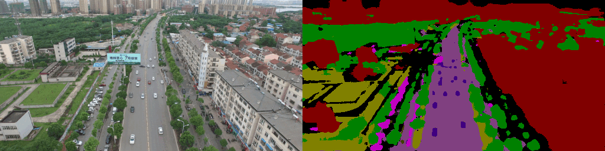

<h1 align="center">
    Semantic segmentation | </br> Applied on a high-resolution UAV street scene imagery
</h1>
<div style=width:100%>
    
</div>


## Dataset

The dataset contains 270 paired samples, split into:

- **Training**: 200 samples
- **Validation**: 70 samples

Each paired sample consists of an image and its corresponding label or mask. Additionally, there are 150 single images provided for testing purposes.

The label images include annotations for 8 RGB classes, which are used for semantic segmentation. Each class is associated with a unique RGB value. 
The labels are later encoded as numbers ranging from 0 to 7.
|Class|R, G, B|Encode|
|-----|-------|:----:|
|Background clutter | `(0, 0, 0)`     |`0`|   
|Building           | `(128, 0, 0)`   |`1`|
|Road               | `(128, 64, 128)`|`2`|
|Tree               | `(0, 128, 0)`   |`3`|
|Low vegetation     | `(128, 128, 0)` |`4`|
|Moving car         | `(64, 0, 128)`  |`5`|
|Static car         | `(192, 0, 192)` |`6`|
|human              | `(64, 64, 0)`   |`7`|

<br>

### Aug_pre dataset

Data augmentation and preprocessing techniques were applied to generate additional data, making it ready for direct use in training.

- **Original resolution**: 540x960  
- **New resolution**: 256x512 
- **Total size**: 810 samples

This dataset requires minimal preprocessing before training.

<br>

### Download

|Resolution|Google Drive|Github|
|:---------|:----------:|:----:|
|Aug_pre (256 x 512)|None|[Download](https://github.com/pmohmmed/aug_pre/archive/refs/heads/main.zip)|
|Orig (540 x 960)|[Download](https://drive.google.com/drive/folders/1qJzEsf-S0Kg2SSYELEBl4D9lo9ytIpax)|None

<br>

The Structure of dataset directory:
```
dataset/
  ├── train_data/
  │   ├── Images/
  │   └── Labels/
  │
  ├── val_data/
  │   ├── Images/
  │   └── Labels/
  │
  └── test_data/
      └── Images/
```

<br>

## Environment setup
- Clone this repo:
  ```bash
  git clone https://github.com/pmohmmed/semantic-segmentation-uav.git;
  
  cd semantic-segmentation-uav
  ```


  <br>

- Create and activate virtual environment (for more organization):

  ```bash
  python3 -m venv demo_env && source demo_env/bin/activate
  ```

<br>

- Install python dependencies:

  ```bash
  pip install -r requirements.txt
  ```

<br>

- Refer to the [Download](#download) section to download the dataset (if you haven’t already).

<br>


## Augmentation
Skip this stage if you are using the [aug_pre](#aug_pre-dataset) dataset.

To proceed, run **augment.sh** script:
```bash 
bash scripts/augment.sh
```

-- OR --

Command:
```bash
python3 -m augment \
        --data_path path/to/dataset \
        --aug_data_path path/to/save/aug_data \
        --pre_obj_path path/to/preprocessor/pre.pkl \
        --pre True \
        --res 256 \
```

<br>

## Train

Run **train.sh** script:
```bash
bash scripts/train.sh
```

-- OR --

Command:
```bash
## set --enc True if the data labels are RGB
python3 -m train \
        --lr 0.001 \
        --epochs 10 \
        --batch_size 16 \
        --enc False \
        --res 256 \
        --data_path path/to/dataset/ \
        --model_path path/to/save/model/unet.keras \
```

<br>

## Inference

Run **test.sh** script:
```bash
bash scripts/test.sh
```

-- OR --

Command:
```bash
python3 -m test \
        --data_path path/to/test_data \
        --results_path path/to/save/results/\
        --model_path path/to/model/unet.keras \
        --show_results False
``` 
<br>

## Upcoming Work
- Evaluate model performance using metrics such as IoU, SSIM, mIoU, F1-Score, etc.
- Experiment with different architectures to improve accuracy and efficiency.
- Expand and refine the dataset for better generalization.
- Implement and optimize real-time inference capabilities.
